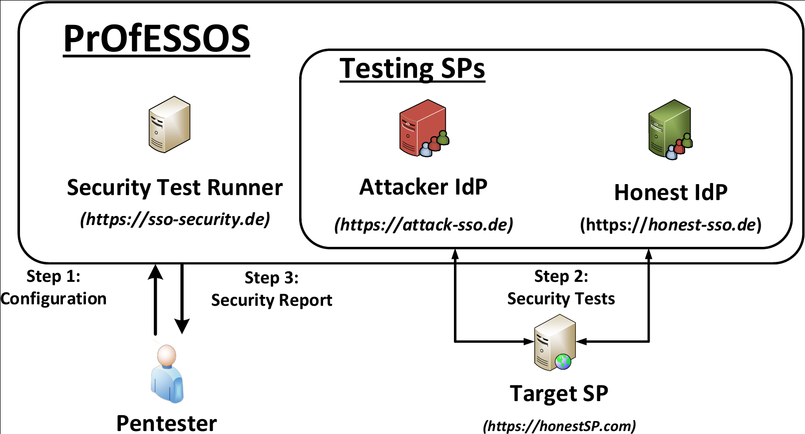

# PrOfESSOS
PrOfESSOS is our open source implementation for fully automated Evaluation-as-a-Service for SSO.
PrOfESSOS introduces a generic approach to improve the security of OpenID Connect implementations by systematically detecting vulnerabilities.

A user of PrOfESSOS – the penetration tester – can access it on its website. 
We provide a running demo of PrOfESSOS at https://openid.sso-security.de.
On the website, the penetration tester can configure it.
Basically, this means that he enters the URL of the target SP and selects the to be tested attacks.
PrOfESSOS itself makes use of the other components in the background, which are described in the following.
These components interact with each other and the target SP, perform the attacks, evaluate if they are successful, and presents the results.

<h4>Security Test Runner (STR).</h4> PrOfESSOS is an EaaS.
As such, it is available for multiple penetration testers simultaneously. The STR component is basically the executing
processor of PrOfESSOS so that multiple, parallel, running tests do not interfere with each other. The STR navigates the attacker IdP during testing, gets the HTTP and HTML results back, and evaluates if an attack is successful or not.

<h4>The Attacker IdP.</h4> The attacker IdP is a highly configurable IdP capable to act honestly and maliciously. The IdP gets information from the STR about the target SP, for example, important URLs needed to start the authentication flow (e.g. login page URL). In addition, it needs information to verify if the login was successful, for example, a URL to the user profile and an attack description, containing information about the attack protocol flow, plus order and content of the messages. The IdP logs all information during testing and pushes the results to the STR.

<h4>Honest IdP.</h4> Using only one IdP for testing implementations is quite limited. During some attacks, the attacker IdP confuses the SP by making it to believe that it communicates with the honest IdP, see IDS or Issuer Confusion attacks, which require interaction between the SP and the honest IdP. Unfortunately, the attacker IdP cannot observe this communication. Thus, it is not possible to analyze the exact behavior of the SP during the attacks and evaluate the results. To solve this limitation, PrOfESSOS introduces a second IdP (honest IdP acting honestly and not performing any attacks. Instead, it is only used to simulate the victim’s IdP and to observe the communication between the SP and any honest IdP. Similar to the attacker IdP, the honest IdP
pushes reports to the STR, which evaluates the results.

# Usage
PrOfESSOS evaluates the target SP in three stages:

<h4>Stage 1: </h4> Setup. PrOfESSOS is configured with the necessary parameters so that it can later on login at the target SP automatically. First, PrOfESSOS calls URL.SP.target, fetches the HTML document, and tries to detect the login form. Then, it enters the URL of the attacker IdP to start the authentication. Finally, a screenshot is presented to the penetration tester so that he can verify if the correct login form is going to be used or further parameters have to be configured.

<h4>Stage 2:</h4> Configuration Evaluation. PrOfESSOS uses the configuration from the first stage and checks if it can
be used to automatically login. If any error appears, the penetration tester is notified and the first stage is restarted.
PrOfESSOS visits URL.SP.target and simulates a login with the honest IdP and consequentially with the attacker IdP. PrOfESSOS then has to determine the final state of a successful login. This is necessary so that it can later on verify if an attack leads to a successful login and which account is accessed. Some SPs show the login name directly on the website after the authentication, but others do not. To address this problem, the penetration tester can provide a string value (UserNeedle) uniquely identifying the authenticated End-User on the SP. This can be for instance the URL with the End-User’s profile information.
Finally, PrOfESSOS starts a faulty login attempt. The only difference to the first one is that PrOfESSOS this time
generates invalid responses leading to an invalid login attempt on the SP. PrOfESSOS analyzes the final state after
all redirects and thus is able to determine failed logins during attacking.

<h4>Stage 3:</h4> Attacks. In this stage, the penetration tester selects different attacks that are going to be tested against the
target SP. He can choose from all attacks described in Section 5 and 6. All attacks have detailed descriptions regarding
what is going to be evaluated. The STR then executes the selected attacks by using the previously configured SP.

# Demos
https://openid.sso-security.de

# Licence

